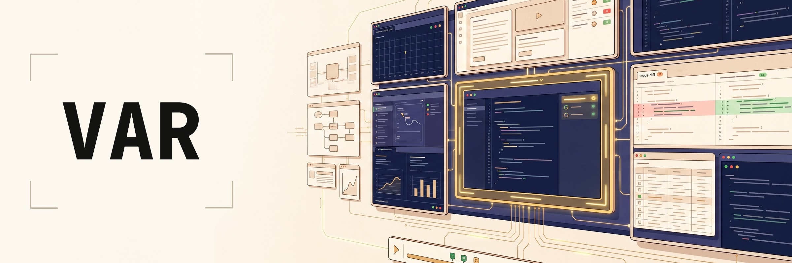
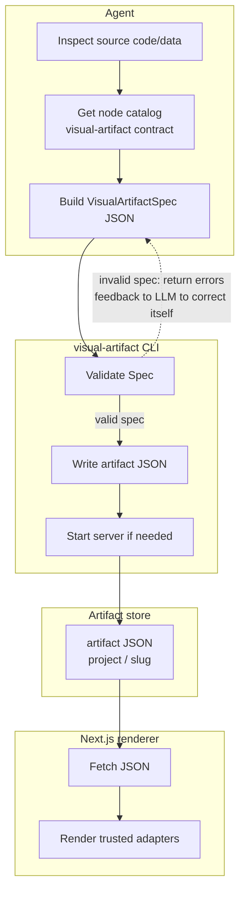

# Visual Artifact Renderer



Visual Artifact Renderer turns agent output into polished visual pages: reports, code reviews, architecture briefs, dashboards, explainers, and structured summaries. The result is a shared surface both AI and humans can read, comment on, and iterate together.

The idea is simple: **agents emit JSON, not HTML or React.**

## Demo

https://github.com/user-attachments/assets/1fdc9a6e-9566-4ae6-904d-dee1b8ee5e05

## Try it with prompts

Ask your agent for a visual artifact when the answer would be easier to scan:

- `Create a visual artifact explaining the authentication flow`
- `Compare these two solutions using a visual artifact`
- `Walk me through these code changes using a visual artifact`

## What problem this solves

HTML articles are a good way to explain complex work, but generating full HTML from an LLM is inconsistent, awkward to constrain, and burns tokens. Visual Artifact Renderer gives agents a smaller surface: pick known UI nodes, provide data, and let a trusted renderer handle the page.

Visual Artifact Renderer is a generative-UI, server-driven runtime for that gap. The model describes **what** to show; the renderer owns **how** it looks.

## How it works



The core flow:

1. Agent runs `visual-artifact contract` to see the available node types, then builds a `VisualArtifactSpec`.
3. CLI validates the spec against the exported contract.
4. CLI writes `<skill-root>/artifacts/<project>/<slug>.json`.
5. CLI starts the renderer if needed.
6. Browser opens `/artifacts/<project>/<slug>/`.
7. The Next.js app fetches JSON and renders trusted adapters.

The LLM never writes routes, imports, JSX, CSS, or full HTML for the renderer.

## Features

- **Constrained JSON contract** — `slug`, `title`, optional `data`, and typed `nodes`.
- **30+ node types** — prose, stat cards, tables, charts, timelines, Mermaid, SVG diagrams, tabs, accordions, logs, diffs, and more.
- **Data-backed components** — tables, charts, status grids, and timelines reference datasets by `dataKey`.
- **Local-first storage** — generated artifacts stay under the installed skill root unless overridden.
- **CLI** — use `visual-artifact` directly.
- **Pi extension/tool** — let Pi call `create_visual_artifact` from inside a session.
- **Static renderer, live JSON** — the renderer is built once; new artifacts appear without rebuilding.
- **Annotations and AI Colab** — node-level comment threads with resolve/reopen, plus an in-memory AI Colab mode for reviewing formatter comments and exporting them as Markdown.
- **Safe rendering boundary** — validation before write, Zod parse before render, adapter-only UI.

## Quick start

The fastest way to install is with the curl-to-sh installer. It downloads a prebuilt binary plus the renderer static export, skill bundle, and Pi extension for your platform:

```bash
curl -fsSL https://github.com/iurysza/visual-artifact-renderer/releases/latest/download/install.sh | sh
export PATH="$HOME/.local/bin:$PATH"
visual-artifact doctor
```

Requirements for source builds: Bun, pnpm, Node.js 20+. Pi is optional; if present, the installer installs the Pi extension too.

Install from this repo instead:

```bash
cd cli
bun install
bun run src/main.ts bootstrap
export PATH="$HOME/.local/bin:$PATH"
visual-artifact doctor
```

`bootstrap` builds the renderer and CLI, then installs the pieces agents need:

| Piece | Installed location |
| ----- | ------------------ |
| CLI binary | `~/.local/bin/visual-artifact` |
| App static export | `~/.local/share/visual-artifact/app/out` |
| Skill files | `~/.agents/skills/visual-artifact/` (`SKILL.md` + `references/` + `artifacts/`) |
| Artifact storage | `~/.agents/skills/visual-artifact/artifacts/<project>/<slug>/` (or `<project-root>/artifacts/` in this repo) |
| Pi extension | `~/.pi/agent/extensions/visual-artifact.ts`, registered in `~/.pi/agent/settings.json` |

The artifact contract is bundled into the CLI; it is no longer shipped as a static file in the skill target. Run `visual-artifact contract` to print it.

For Pi, run `/reload` or restart Pi after install. The extension loads the global skill and registers the `create_visual_artifact` tool plus `/visual-diff` and `/visual-recap`.

For maintainer release instructions, see [`ai-artifacts/docs/RELEASE.md`](./ai-artifacts/docs/RELEASE.md).

If `visual-artifact` is already on PATH, future updates are just:

```bash
visual-artifact bootstrap
```

Custom harness note: `bootstrap` installs the skill into the common global skill folder. It does not discover arbitrary harness-specific skill roots. If your agent does not read `~/.agents/skills`, copy `~/.agents/skills/visual-artifact` into that harness's skill directory and wire its tool layer to call `visual-artifact create`.

## Annotations

Artifacts support node-level annotation threads and an in-memory AI Colab mode. Open any artifact page and choose **Comments** or **Colab** from the segmented toggle in the header.

### Creating a comment

1. Enable comment mode with the **Comments** toggle.
2. Hover over a rendered node to see a subtle outline; click the node to select it (on touch, tap to preview, tap again to confirm).
3. Write a comment in the right sidebar composer and click **Post**.
4. The thread is anchored to the node and saved to the bundle's `annotations.json`.

### Replying, resolving, and reopening

- Click a thread in the sidebar to view its messages and reply.
- Click **Resolve thread** to mark a thread as resolved.
- Click **Reopen** on a resolved thread to continue the discussion.
- The thread count badge on each node updates in real time.

### AI Colab

AI Colab lets a formatter or agent attach suggested comments to an artifact without persisting them.

1. Enable **Colab** from the header toggle.
2. Review, edit, add, or delete AI comments in the right sidebar.
3. Click **Copy Markdown** to export the artifact plus all current colab comments as a sparse Markdown block.

Colab comments live only in browser state. They are not written to `annotations.json` unless you explicitly convert them to persistent annotations.

### Sharing

Use the **Copy link** button in the sidebar header to copy the canonical artifact page URL.

### Local-only writes

Static-hosted artifacts can **serve** `artifact.json` and `annotations.json`, but they cannot **write** edits back to disk from browser JavaScript. The local `visual-artifact serve` CLI can persist annotations because it runs on your machine and has filesystem access. Hosted comment editing requires a writable backend, Git-backed flow, or similar service in the future.

Authors are inferred from local git config (`user.name` and `user.email`), with a fallback to a local anonymous author when git identity is unavailable.

| Variable                        | Default                               | Description                                                                  |
| ------------------------------- | ------------------------------------- | ---------------------------------------------------------------------------- |
| `VISUAL_ARTIFACT_SKILL_ROOT`    | auto-detected                         | Override skill root lookup.                                                  |
| `VISUAL_ARTIFACT_ARTIFACTS_DIR` | `<project-root>/artifacts` or `<skill-root>/artifacts` | Runtime artifact JSON store.                                                 |
| `VISUAL_ARTIFACT_OUT_DIR`       | `~/.local/share/visual-artifact/app/out` or `<project-root>/app/out` | Static renderer export.                                                   |
| `VISUAL_ARTIFACT_PORT`          | `9998`                                | Static-preview server port.                                                  |
| `VISUAL_ARTIFACT_HOST`          | `127.0.0.1`                           | Server bind host.                                                            |
| `VISUAL_ARTIFACT_MOUNT_PATH`    | `/artifacts`                          | Public route prefix.                                                         |
| `VISUAL_ARTIFACT_DATA_PATH`     | `/data/artifacts`                     | JSON data endpoint under the mount path.                                     |
| `VISUAL_ARTIFACT_OPEN`          | `1`                                   | Open browser when serving. Set `0` to disable.                               |
| `VISUAL_ARTIFACT_BASE_URL`      | local server URL                      | Base URL returned by `create`/`open`; include `/artifacts` if using a proxy. |
| `VISUAL_ARTIFACT_CONTRACT_PATH` | `<project-root>/cli/assets/contract.json` | Override contract path.                                                      |
| `VISUAL_ARTIFACT_CLOUDFLARE_R2_BUCKET` | — | R2 bucket name for publishing.                                               |
| `VISUAL_ARTIFACT_CLOUDFLARE_R2_ACCESS_KEY_ID` | — | R2 S3-compatible access key ID.                                              |
| `VISUAL_ARTIFACT_CLOUDFLARE_R2_SECRET_ACCESS_KEY` | — | R2 S3-compatible secret access key.                                          |
| `VISUAL_ARTIFACT_CLOUDFLARE_ACCOUNT_ID` | — | Cloudflare account ID.                                                       |
| `VISUAL_ARTIFACT_CLOUDFLARE_BASE_URL` | — | Public base URL for published artifacts; `/artifacts` is appended when missing. |
| `VISUAL_ARTIFACT_CLOUDFLARE_WORKERS_DEV_SUBDOMAIN` | — | workers.dev subdomain for quickstart base URL.                               |
| `VISUAL_ARTIFACT_CLOUD_ROUTE_STRATEGY` | `zero-pages` | Cloud build dynamic-route strategy: `zero-pages` or `placeholder`.           |

## Create an artifact

From a file:

```bash
visual-artifact create my-spec.json
```

From stdin:

```bash
cat my-spec.json | visual-artifact create
visual-artifact create - < my-spec.json
```

Minimal spec:

```json
{
  "slug": "demo-report",
  "title": "Demo Report",
  "description": "A tiny Visual Artifact Renderer artifact.",
  "nodes": [
    {
      "type": "text",
      "props": {
        "text": "The agent supplied JSON. The renderer supplied the UI.",
        "size": "lg"
      }
    }
  ]
}
```

The CLI returns a URL like:

```text
http://127.0.0.1:9998/artifacts/my-project/demo-report/
```

### Publishing to Cloudflare

Visualizer supports BYO Cloudflare publishing so artifacts get durable public URLs under your own account. One-time setup:

```bash
visual-artifact setup cloudflare --account-id <id> --bucket <name> --workers-dev-subdomain <subdomain>
```

The CLI reads R2 secrets from environment variables. For local development you can put them in a `.env` file in the working directory:

```text
VISUAL_ARTIFACT_CLOUDFLARE_R2_ACCESS_KEY_ID=...
VISUAL_ARTIFACT_CLOUDFLARE_R2_SECRET_ACCESS_KEY=...
```

`.env` is optional and never loaded if the variables are already set in the shell.

Then publish from `create`:

```bash
visual-artifact create my-spec.json --publish
```

On success the JSON output's `url` field is the remote public page. `localUrl` is also included for debugging, and a local `publish.json` sidecar is written beside `artifact.json` with non-secret publish state. Secrets are read from environment variables only; the saved profile contains non-secret config and is stored under `~/.config/visual-artifact/publish-profiles/` with mode `0600`.

Hosted annotations are read-only in MVP; the Worker returns `501 Not Implemented` for annotation mutation posts.

To build the renderer for Cloudflare, use `cd app && pnpm build:cloud`. This exports only shared shells and runs a leak verifier so no local artifact pages are baked into the deploy.

By default, artifacts are written as bundles to:

```text
<skill-root>/artifacts/<project>/<slug>/
  artifact.json
  annotations.json
  publish.json   # present after successful --publish
  assets/
```

In this source repo that is `artifacts/`, which is intentionally gitignored.

## CLI

```text
visual-artifact [global flags] <command>
```

Global flags: `--json`, `--plain`, `--quiet`, `--verbose`, `--no-color`, `--no-input`.

| Command                                                                 | Purpose                                                                              |
| ----------------------------------------------------------------------- | ------------------------------------------------------------------------------------ |
| `visual-artifact bootstrap [--dry-run]`                                 | Build renderer and CLI; install CLI, global skill, and optional Pi extension copies. |
| `visual-artifact create [spec.json or -] [--project path] [--no-serve] [--publish [profile]]` | Validate, write artifact JSON, auto-start renderer, optionally publish to Cloudflare. |
| `visual-artifact validate [spec.json or -]`                             | Validate without writing.                                                            |
| `visual-artifact contract`                                              | Print the current artifact contract to stdout.                                       |
| `visual-artifact serve [--port n] [--host addr] [--no-open]`            | Serve static renderer plus live artifact JSON.                                       |
| `visual-artifact serve status`                                          | Check server health.                                                                 |
| `visual-artifact serve stop`                                            | Best-effort stop; manually kill externally started servers.                          |
| `visual-artifact list [project]`                                        | List projects or artifacts.                                                          |
| `visual-artifact open [project/slug]`                                   | Open the index or one artifact.                                                      |
| `visual-artifact doctor`                                                | Diagnose install/runtime state.                                                      |

Machine-readable output:

```bash
visual-artifact --json create my-spec.json --no-serve
visual-artifact --plain create my-spec.json --no-serve
```

## App development

Renderer:

```bash
cd app
pnpm install
pnpm dev              # http://localhost:9999/artifacts/  (dev + HMR; live mode uses this)
pnpm build            # static export to app/out
pnpm build:cloud      # shell-only export for Cloudflare
pnpm lint
pnpm export:contract
pnpm verify:artifacts
pnpm verify:cloud-build
pnpm visual:qa        # optional adapter/styling QA
```

**Server roles:** `pnpm dev` on `:9999` is the dev/HMR server (also used for live mode). `visual-artifact serve` defaults to `:9998` for the static-export preview and is what `create` auto-starts.

CLI:

```bash
cd cli
bun install
bun run typecheck
bun run build
bun run install:binary
```

## Contract

The contract is generated from renderer source and bundled into the CLI:

- `app/src/lib/contract/artifact-schema.ts`
- `app/src/lib/contract/artifact-manifest.ts`
- `cli/assets/contract.json` (generated build artifact, not committed)

Inspect the current contract from the CLI:

```bash
visual-artifact contract
```

After schema or manifest changes:

```bash
cd app
pnpm export:contract
pnpm verify:artifacts
```

Node reference: [`ai-artifacts/docs/nodes.md`](./ai-artifacts/docs/nodes.md).

## Repository layout

```text
app/                   # Next.js renderer source + static export
cli/                   # Bun CLI source and compiled binary
shared/                # shared annotation schema
pi-extension/
  visual-artifact.ts   # Pi tool wrapper for create_visual_artifact
skill/                 # agent-facing skill bundle
  SKILL.md
  references/          # model-facing usage notes
artifacts/             # local generated JSON, gitignored
```
