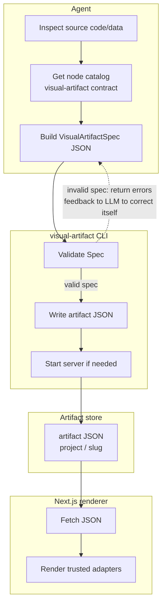

# Visual Artifact Renderer


Visual Artifact Renderer turns agent output into polished visual pages: reports, code reviews, architecture briefs, dashboards, explainers, and structured summaries.

The idea is simple: **agents emit JSON, not HTML or React.**

## Demo

https://github.com/user-attachments/assets/1fdc9a6e-9566-4ae6-904d-dee1b8ee5e05

## Try it with prompts

Ask your agent for a visual artifact when the answer would be easier to scan:

- `Create a visual artifact explaining the authentication flow`
- `Compare these two solutions using a visual artifact`
- `Walk me through these code changes using a visual artifact`


## What problem this solves

HTML articles are a good way to explain complex work, but generating full HTML from an LLM is inconsistent, awkward to constrain, and burns tokens. Visual Artifact Renderer gives agents a smaller surface: pick known UI nodes, provide data, and let a trusted renderer handle the page.

Visual Artifact Renderer is a generative-UI, server-driven runtime for that gap. The model describes **what** to show; the renderer owns **how** it looks.

## How it works



The core flow:

1. Agent runs `visual-artifact contract` to see the available node types, then builds a `VisualArtifactSpec`.
2. Pi tool `create_visual_artifact` delegates to the `visual-artifact` CLI.
3. CLI validates the spec against the exported contract.
4. CLI writes `<skill-root>/artifacts/<project>/<slug>.json`.
5. CLI starts the renderer if needed.
6. Browser opens `/artifacts/<project>/<slug>/`.
7. The Next.js app fetches JSON and renders trusted adapters.

The LLM never writes routes, imports, JSX, CSS, or full HTML for the renderer.

## Features

- **Constrained JSON contract** — `slug`, `title`, optional `data`, and typed `nodes`.
- **30+ node types** — prose, stat cards, tables, charts, timelines, Mermaid, SVG diagrams, tabs, accordions, logs, diffs, and more.
- **Data-backed components** — tables, charts, status grids, and timelines reference datasets by `dataKey`.
- **Local-first storage** — generated artifacts stay under the installed skill root unless overridden.
- **CLI + Pi extension/tool** — use `visual-artifact` directly or let Pi call `create_visual_artifact`.
- **Static renderer, live JSON** — the renderer is built once; new artifacts appear without rebuilding.
- **Annotations and AI Colab** — node-level comment threads with resolve/reopen, plus an in-memory AI Colab mode for reviewing formatter comments and exporting them as Markdown.
- **Safe rendering boundary** — validation before write, Zod parse before render, adapter-only UI.

## Quick start

Requirements: Bun, pnpm, Node.js 20+. Pi is optional; if present, bootstrap installs the Pi extension too.

Install the agent integration from this repo:

```bash
cd skill/cli
bun install
bun run src/main.ts bootstrap
export PATH="$HOME/.local/bin:$PATH"
visual-artifact doctor
```

`bootstrap` builds the renderer and CLI, then installs the pieces agents need:

- CLI binary: `~/.local/bin/visual-artifact`
- global skill copy: `~/.agents/skills/visual-artifact`
- Pi extension copy, only when Pi is detected: `~/.pi/agent/extensions/visual-artifact.ts`

For Pi, run `/reload` or restart Pi after install. The extension loads the global skill and registers the `create_visual_artifact` tool plus `/visual-diff` and `/visual-recap`.

If `visual-artifact` is already on PATH, future updates are just:

```bash
visual-artifact bootstrap
```

Custom harness note: `bootstrap` installs the skill into the common global skill folder. It does not discover arbitrary harness-specific skill roots. If your agent does not read `~/.agents/skills`, copy `~/.agents/skills/visual-artifact` into that harness's skill directory and wire its tool layer to call `visual-artifact create`.

## Create an artifact

From a file:

```bash
visual-artifact create my-spec.json
```

From stdin:

```bash
cat my-spec.json | visual-artifact create
visual-artifact create - < my-spec.json
```

Minimal spec:

```json
{
  "slug": "demo-report",
  "title": "Demo Report",
  "description": "A tiny Visual Artifact Renderer artifact.",
  "nodes": [
    {
      "type": "text",
      "props": {
        "text": "The agent supplied JSON. The renderer supplied the UI.",
        "size": "lg"
      }
    }
  ]
}
```

The CLI returns a URL like:

```text
http://127.0.0.1:9999/artifacts/my-project/demo-report/
```

By default, artifacts are written as bundles to:

```text
<skill-root>/artifacts/<project>/<slug>/
  artifact.json
  annotations.json
  assets/
```

In this source repo that is `skill/artifacts/`, which is intentionally gitignored except placeholders.

## CLI

```text
visual-artifact [global flags] <command>
```

Global flags: `--json`, `--plain`, `--quiet`, `--verbose`, `--no-color`, `--no-input`.

| Command | Purpose |
|---|---|
| `visual-artifact bootstrap [--dry-run]` | Build renderer and CLI; install CLI, global skill, and optional Pi extension copies. |
| `visual-artifact create [spec.json or -] [--project path] [--no-serve]` | Validate, write artifact JSON, auto-start renderer unless disabled. |
| `visual-artifact validate [spec.json or -]` | Validate without writing. |
| `visual-artifact contract` | Print the current artifact contract to stdout. |
| `visual-artifact serve [--port n] [--host addr] [--no-open]` | Serve static renderer plus live artifact JSON. |
| `visual-artifact serve status` | Check server health. |
| `visual-artifact serve stop` | Best-effort stop; manually kill externally started servers. |
| `visual-artifact list [project]` | List projects or artifacts. |
| `visual-artifact open [project/slug]` | Open the index or one artifact. |
| `visual-artifact doctor` | Diagnose install/runtime state. |

Machine-readable output:

```bash
visual-artifact --json create my-spec.json --no-serve
visual-artifact --plain create my-spec.json --no-serve
```

## App development

Renderer:

```bash
cd skill/app
pnpm install
pnpm dev              # http://localhost:9999/artifacts/
pnpm build            # static export to skill/app/out
pnpm lint
pnpm export:contract
pnpm verify:artifacts
pnpm visual:qa        # optional adapter/styling QA
```

CLI:

```bash
cd skill/cli
bun install
bun run typecheck
bun run build
bun run install:binary
```

## Contract

The contract is generated from renderer source:

- `skill/app/src/lib/artifact-schema.ts`
- `skill/app/src/lib/artifact-manifest.ts`
- `skill/artifact-contract.json`

Inspect the current contract from the CLI:

```bash
visual-artifact contract
```

After schema or manifest changes:

```bash
cd skill/app
pnpm export:contract
pnpm verify:artifacts
```

Node reference: [`docs/nodes.md`](./docs/nodes.md).

## Annotations

Artifacts support node-level annotation threads and an in-memory AI Colab mode. Open any artifact page and choose **Comments** or **Colab** from the segmented toggle in the header.

### Creating a comment

1. Enable comment mode with the **Comments** toggle.
2. Hover over a rendered node to see a subtle outline; click the node to select it (on touch, tap to preview, tap again to confirm).
3. Write a comment in the right sidebar composer and click **Post**.
4. The thread is anchored to the node and saved to the bundle's `annotations.json`.

### Replying, resolving, and reopening

- Click a thread in the sidebar to view its messages and reply.
- Click **Resolve thread** to mark a thread as resolved.
- Click **Reopen** on a resolved thread to continue the discussion.
- The thread count badge on each node updates in real time.

### AI Colab

AI Colab lets a formatter or agent attach suggested comments to an artifact without persisting them.

1. Enable **Colab** from the header toggle.
2. Review, edit, add, or delete AI comments in the right sidebar.
3. Click **Copy Markdown** to export the artifact plus all current colab comments as a sparse Markdown block.

Colab comments live only in browser state. They are not written to `annotations.json` unless you explicitly convert them to persistent annotations.

### Sharing

Use the **Copy link** button in the sidebar header to copy the canonical artifact page URL.

### Local-only writes

Static-hosted artifacts can **serve** `artifact.json` and `annotations.json`, but they cannot **write** edits back to disk from browser JavaScript. The local `visual-artifact serve` CLI can persist annotations because it runs on your machine and has filesystem access. Hosted comment editing requires a writable backend, Git-backed flow, or similar service in the future.

Authors are inferred from local git config (`user.name` and `user.email`), with a fallback to a local anonymous author when git identity is unavailable.

| Variable | Default | Description |
|---|---|---|
| `VISUAL_ARTIFACT_SKILL_ROOT` | auto-detected | Override skill root lookup. |
| `VISUAL_ARTIFACT_ARTIFACTS_DIR` | `<skill-root>/artifacts` | Runtime artifact JSON store. |
| `VISUAL_ARTIFACT_OUT_DIR` | `<skill-root>/app/out` | Static renderer export. |
| `VISUAL_ARTIFACT_PORT` | `9999` | Server port. |
| `VISUAL_ARTIFACT_HOST` | `127.0.0.1` | Server bind host. |
| `VISUAL_ARTIFACT_MOUNT_PATH` | `/artifacts` | Public route prefix. |
| `VISUAL_ARTIFACT_DATA_PATH` | `/data/artifacts` | JSON data endpoint under the mount path. |
| `VISUAL_ARTIFACT_OPEN` | `1` | Open browser when serving. Set `0` to disable. |
| `VISUAL_ARTIFACT_BASE_URL` | local server URL | Base URL returned by `create`/`open`; include `/artifacts` if using a proxy. |
| `VISUAL_ARTIFACT_CONTRACT_PATH` | `<skill-root>/artifact-contract.json` | Override contract path. |

## Repository layout

```text
skill/
  SKILL.md
  artifact-contract.json
  app/                 # Next.js renderer source + static export
  artifacts/           # local generated JSON, gitignored
  cli/                 # Bun CLI source and compiled binary
  references/          # model-facing usage notes
pi-extension/
  visual-artifact.ts   # Pi tool wrapper for create_visual_artifact
docs/
  nodes.md             # node catalog and composition patterns
ai-artifacts/
  docs/                # architecture/product/reliability/design docs
```
