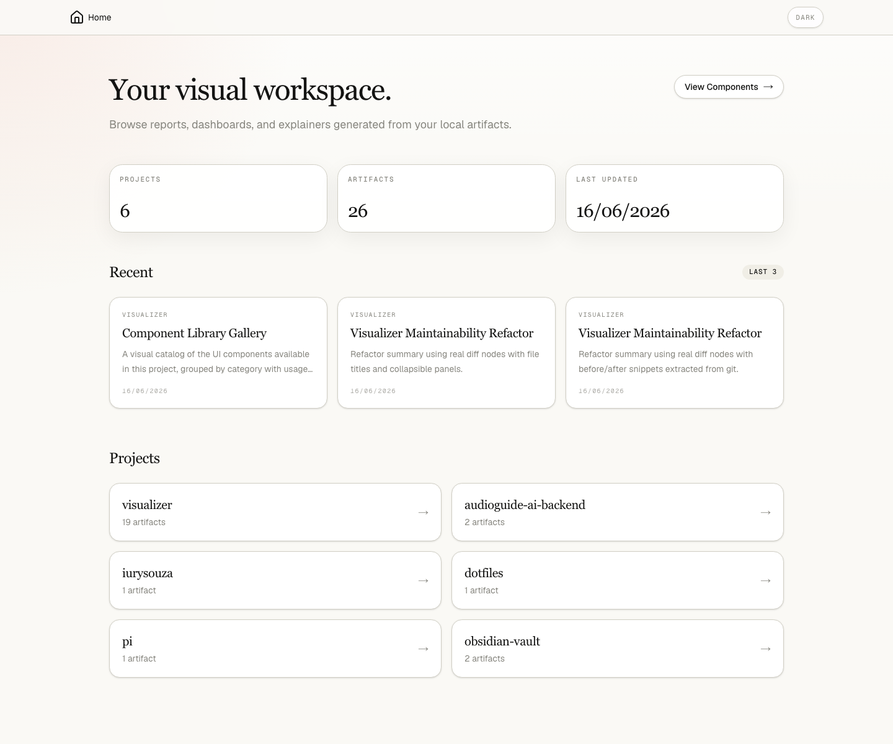
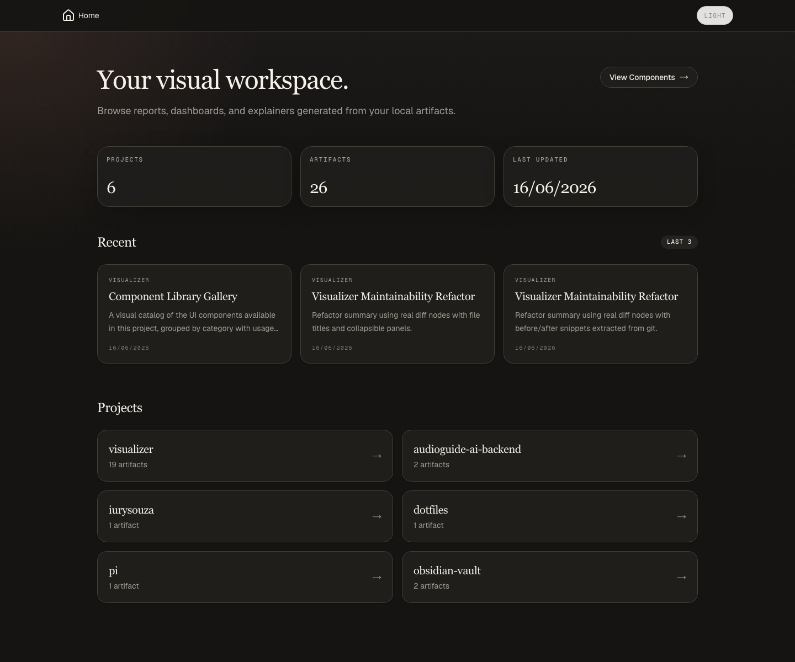

# Visualizer

Visualizer turns AI-generated JSON into polished, shareable visual pages — reports, dashboards, architecture briefs, runbooks, and explainers. It gives agents a safe presentation layer: pick known nodes, embed data, call one tool, get a local URL.

The important trick: **the LLM never writes React, routes, JSX, imports, or CSS.** It emits a constrained artifact spec; the renderer maps each node to trusted UI adapters. That containment is the point — agents get rich output without generating arbitrary code.

[](LICENSE)

- **JSON-first**: agents emit specs, not source code
- **36 node types**: stat cards, tables, charts, mermaid diagrams, timelines, status grids, and more
- **Local-first**: artifacts live in `~/.pi/artifacts`, served from your machine
- **Instant sharing**: built-in Tailscale support for tailnet URLs
- **Static + live**: build once, then keep loading new artifacts without rebuilding

<table>
  <tr>
    <td width="50%" align="center">
      
      <br />
      <sub>Visualizer home in light mode</sub>
    </td>
    <td width="50%" align="center">
      
      <br />
      <sub>Visualizer home in dark mode</sub>
    </td>
  </tr>
</table>

## Install

From the repo root:

```bash
./install.sh
```

This copies the Pi skill to `~/.pi/skills/visual-artifact`, the extension to `~/.pi/agent/extensions/visual-artifact.ts`, links the runtime to `~/.pi/tools/visualizer`, installs `vaz-*` wrapper scripts to `~/.pi/bin`, and runs `pnpm install`.

Requirements:

- Node.js 20+
- pnpm
- macOS, Linux, or Windows
- Pi coding agent (for the extension and skill)

## Quick start

### 1. Run the renderer locally

```bash
pnpm dev
```

Open `http://localhost:9999/artifacts/`.

### 2. Create an artifact from data

```bash
export PATH="$HOME/.pi/bin:$PATH"
vaz-serve   # ensures the renderer is running
```

Then ask your agent to call:

```text
create_visual_artifact with title "Q2 Revenue", slug "q2-revenue", and a few stat-card nodes.
```

The tool writes `~/.pi/artifacts/<project>/<slug>.json` and returns a URL like:

```txt
http://localhost:9999/artifacts/my-project/q2-revenue/
```

### 3. Generate a codebase artifact

For repo overviews or architecture diagrams, use the pipeline instead of hand-writing the spec:

```bash
vaz-pipeline /path/to/repo [slug]
```

It writes `visual-artifact-spec.json` under `<repoRoot>/ai-artifacts/generated/<slug>/`. Read that file and call `create_visual_artifact` with its payload. See [`pi-skill/visual-artifact/SKILL.md`](./pi-skill/visual-artifact/SKILL.md) for the full routing logic.

## How it works

```txt
LLM reads artifact-contract.json
  → calls create_visual_artifact(JSON)
  → Pi extension validates the spec
  → writes ~/.pi/artifacts/<project>/<slug>.json
  → /artifacts/<project>/<slug>/ renders the spec
  → VisualArtifactRenderer maps nodes to UI adapters
```

The LLM creates JSON specs, not React files or routes.

## Why Visualizer?

| Capability | Visualizer | Hand-rolled React/Next.js | Streamlit / Gradio | Static site + Mermaid | Jupyter |
| --- | :---: | :---: | :---: | :---: | :---: |
| Agent emits JSON, not code | ✅ | ❌ | ❌ | ❌ | ❌ |
| No arbitrary code execution risk | ✅ | ❌ | ⚠️ | ✅ | ❌ |
| 36 purpose-built report nodes | ✅ | ❌ | partial | ❌ | partial |
| Works from any agent session | ✅ | ❌ | ❌ | ❌ | ❌ |
| Static export + live reload | ✅ | build it | ❌ | rebuild | ❌ |
| Built-in Tailscale sharing | ✅ | ❌ | ❌ | ❌ | ❌ |
| Local-first, no cloud upload | ✅ | ✅ | ❌ | ✅ | ❌ |

Visualizer is optimized for agents that need to produce rich, readable pages without touching the frontend.

## Supported nodes

Visualizer ships **36** node types. See the full reference in [`docs/nodes.md`](./docs/nodes.md).

Highlights:

- **Dashboard tiles**: `stat-card`, `metric`, `status-grid`
- **Data**: `table`, `data-table`, `comparison-table`, `chart`, `heatmap`
- **Diagrams**: `mermaid`, `svg-diagram`, `flow`
- **Narrative**: `heading`, `text`, `prose`, `card`, `section`, `tabs`, `accordion`
- **Code**: `code-block`, `diff`, `file-tree`
- **Other**: `alert`, `badge`, `button`, `image`, `log`, `pie-chart`, `donut-chart`, `area-chart`, `radar-chart`, `scatter-chart`, `stepper`, `timeline`, `separator`

## Running locally

### Dev server

```bash
pnpm dev
```

Runs on `http://localhost:9999/artifacts/`. All routes are under `basePath: "/artifacts"`.

### Static export + live server

Build once, then run the tiny static server (no Next.js dev overhead):

```bash
pnpm build
pnpm serve
```

The server binds to `127.0.0.1:9999` by default and serves the built `out/` directory under `/artifacts/`:

```txt
http://localhost:9999/artifacts/
```

This same `/artifacts/` path is used everywhere — local dev, the static server, Tailscale, and the blog — only the base URL changes.

Fresh artifact JSON is read from `~/.pi/artifacts/` at `/artifacts/data/artifacts/<project>/<slug>.json`. The home page and project index pages also load live from `~/.pi/artifacts/`, so new artifacts appear immediately without rebuilding. If a new artifact was created after the last build, `pnpm serve` serves a generic live shell at `/artifacts/<project>/<slug>/` and loads that JSON client-side. New projects created after the build are similarly served by a `/artifacts/<project>/` live shell.

### Tailscale Serve

Expose it on your tailnet using the same `/artifacts/` path:

```bash
vaz-tailscale setup
```

Or manually:

```bash
tailscale serve --yes --bg --https 443 --set-path /artifacts/ http://127.0.0.1:9999/artifacts
```

Then open the tailnet URL returned by:

```bash
vaz-tailscale url <project> <slug>
```

If you want `create_visual_artifact` to return tailnet URLs by default, set:

```bash
export VISUAL_ARTIFACT_BASE_URL="$(vaz-tailscale url)"
```

## Advanced

### Wrapper commands

After `./install.sh`, these are available in `~/.pi/bin/` (add it to your PATH):

| Command | Purpose |
| --- | --- |
| `vaz-doctor` | Verify runtime, deps, wrappers, tools, and renderer health |
| `vaz-serve` | Start the renderer on `http://localhost:9999/artifacts/` if not running |
| `vaz-status` | Check if the renderer is running. Returns JSON |
| `vaz-pipeline <repoRoot> [slug]` | Run the full codebase extraction + assembly pipeline |
| `vaz-tailscale url [project] [slug]` | Return the shareable tailnet URL |
| `vaz-tailscale setup` | Configure Tailscale Serve proxy |

### Environment variables

```bash
VISUALIZER_PORT=9999
VISUALIZER_HOST=127.0.0.1
VISUALIZER_OUT_DIR=./out
VISUALIZER_ARTIFACTS_DIR=~/.pi/artifacts
VISUALIZER_MOUNT_PATH=/artifacts
VISUALIZER_OPEN=1
VISUAL_ARTIFACT_BASE_URL=http://localhost:9999/artifacts
VISUALIZER_CONTRACT_PATH=/path/to/visualizer
```

## Verify & QA

```bash
pnpm lint
pnpm export:contract
pnpm test:contract
pnpm verify:artifacts
pnpm build
```

Visual QA (requires a running dev server):

```bash
pnpm visual:qa
```

Health check (requires a running server):

```bash
pnpm health-check
```

## Examples

Sample artifacts created from this repo:

```txt
http://localhost:9999/artifacts/visualizer/revenue-dashboard/
http://localhost:9999/artifacts/visualizer/implementation-plan/
http://localhost:9999/artifacts/visualizer/agent-stack-report/
```

For copyable JSON patterns, see [`docs/nodes.md`](./docs/nodes.md).

## Contributing

For the engineering handoff — repo map, architecture, common tasks, and pitfalls — read [`ai-artifacts/AGENT_ONBOARDING.md`](./ai-artifacts/AGENT_ONBOARDING.md).

For the model-facing usage router, read [`pi-skill/visual-artifact/SKILL.md`](./pi-skill/visual-artifact/SKILL.md).

## License

[MIT](LICENSE)
