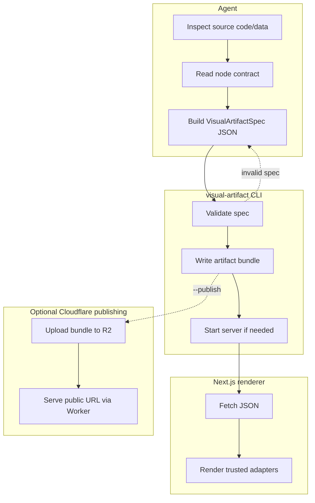

# Visual Artifact Renderer


Visual Artifact Renderer turns agent output into polished visual pages: reports, code reviews, architecture briefs, dashboards, explainers, and structured summaries.

The rule is simple: **agents emit JSON, not HTML or React.** The renderer owns layout, styling, validation, and interaction.

## Demo

https://github.com/user-attachments/assets/1fdc9a6e-9566-4ae6-904d-dee1b8ee5e05

## Try it with prompts

Ask your agent for a visual artifact when markdown would be hard to scan:

- `Create a visual artifact explaining the authentication flow`
- `Compare these two solutions using a visual artifact`
- `Walk me through these code changes using a visual artifact`

## What it solves

LLM-generated HTML is brittle. It burns tokens, drifts in style, and is hard to validate.

Visual Artifact Renderer gives agents a smaller surface: pick known UI nodes, provide data, and let a trusted renderer handle the page. The model describes what to show; the renderer decides how it looks.

## How it works



The runtime path:

1. The agent runs `visual-artifact contract` and builds a `VisualArtifactSpec`.
2. The CLI validates the spec and writes an artifact bundle.
3. The renderer fetches `artifact.json` and renders trusted adapters.

The LLM never writes routes, imports, JSX, CSS, or full HTML for the renderer.

## Features

- Constrained JSON contract for `slug`, `title`, optional `data`, and typed `nodes`.
- 30+ node types for prose, cards, tables, charts, timelines, Mermaid, SVG diagrams, tabs, accordions, logs, and diffs.
- Data-backed components that reference shared datasets by `dataKey`.
- Local-first storage under the installed skill root unless overridden.
- Pi extension with the `create_visual_artifact` tool.
- Static renderer with live JSON, so new artifacts appear without rebuilding.
- Node-level annotations and in-memory AI Colab review mode.
- Optional Cloudflare publishing for durable public links.
- Safe rendering boundary: CLI validation before write, Zod parse before render, adapter-only UI.

## Quick start

Install the latest release:

```bash
curl -fsSL https://github.com/iurysza/visual-artifact-renderer/releases/latest/download/install.sh | sh
export PATH="$HOME/.local/bin:$PATH"
visual-artifact doctor
```

Requirements for source builds: Bun, pnpm, and Node.js 20+. Pi is optional; if present, the installer registers the Pi extension.

Install from this repo instead:

```bash
cd cli
bun install
bun run src/main.ts bootstrap
export PATH="$HOME/.local/bin:$PATH"
visual-artifact doctor
```

If Pi is running, use `/reload` or restart Pi after install.

Update an existing install with:

```bash
visual-artifact bootstrap
```

More install and CLI detail: [`ai-artifacts/docs/cli.md`](./ai-artifacts/docs/cli.md).

## Create an artifact

From a file:

```bash
visual-artifact create my-spec.json
```

From stdin:

```bash
visual-artifact create - < my-spec.json
```

Minimal spec:

```json
{
  "slug": "demo-report",
  "title": "Demo Report",
  "description": "A tiny Visual Artifact Renderer artifact.",
  "nodes": [
    {
      "type": "text",
      "props": {
        "text": "The agent supplied JSON. The renderer supplied the UI.",
        "size": "lg"
      }
    }
  ]
}
```

The CLI returns a local URL like:

```text
http://127.0.0.1:9998/artifacts/my-project/demo-report/
```

## Annotations and AI Colab

Artifacts support node-level comment threads. Open an artifact and use **Comments** to select nodes, post replies, resolve threads, and copy a page link.

**Colab** mode lets a formatter or agent attach suggested comments without persisting them. You can review, edit, delete, or export those comments as Markdown.

Details: [`ai-artifacts/docs/annotations.md`](./ai-artifacts/docs/annotations.md).

## Publishing

Use `--publish` to create a durable public URL through your own Cloudflare account:

```bash
visual-artifact create my-spec.json --publish
```

Published artifacts use R2 for artifact bundles and a Worker for the static renderer, JSON endpoints, and hosted annotation writes.

Setup and deployment: [`ai-artifacts/docs/publishing.md`](./ai-artifacts/docs/publishing.md).

## CLI

Common commands:

```bash
visual-artifact contract
visual-artifact validate my-spec.json
visual-artifact create my-spec.json
visual-artifact serve --no-open
visual-artifact doctor
```

Full command reference: [`ai-artifacts/docs/cli.md`](./ai-artifacts/docs/cli.md).

## Knowledge base

The docs are split like a small wiki. Start at the [`docs index`](./ai-artifacts/docs/index.md), then follow the page that matches your task.

- Use [`CLI`](./ai-artifacts/docs/cli.md) for install paths, command flags, server roles, and configuration.
- Use [`Annotations`](./ai-artifacts/docs/annotations.md) for comments, AI Colab, local writes, and hosted writes.
- Use [`Publishing`](./ai-artifacts/docs/publishing.md) for Cloudflare setup, deploys, `--publish`, and GitHub Actions.
- Use [`Architecture`](./ai-artifacts/ARCHITECTURE.md) when changing boundaries, storage, routes, or data flow.
- Use [`Node reference`](./ai-artifacts/docs/nodes.md) when composing specs or adding node types.

## Development

Renderer:

```bash
cd app
pnpm install
pnpm dev              # http://localhost:9999/artifacts/
pnpm lint
pnpm export:contract
pnpm verify:artifacts
pnpm build
```

CLI:

```bash
cd cli
bun install
bun run typecheck
bun run build
```

Run `pnpm visual:qa` if you touch adapters or styling. Use [`Reliability`](./ai-artifacts/docs/RELIABILITY.md) for the full verification map and [`Release`](./ai-artifacts/docs/RELEASE.md) before publishing a new version.

## Contract

The contract is compiled into the CLI from a shared source:

- `shared/src/contract.ts`
- `cli/assets/contract.json` (generated for docs and tooling, not committed)

Inspect it with:

```bash
visual-artifact contract
```

After contract changes:

```bash
cd app
pnpm export:contract
pnpm verify:artifacts
```

## Repository layout

```text
app/                   # Next.js renderer source + static export
cli/                   # Bun CLI source and compiled binary
shared/                # shared annotation schema
pi-extension/          # Pi tool wrapper for create_visual_artifact
skill/                 # agent-facing skill bundle
artifacts/             # local generated bundles, gitignored
```
