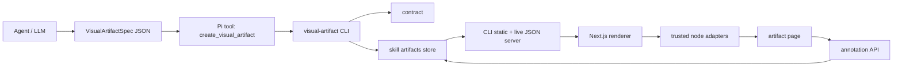

# Visualizer — Architecture

> How the JSON-to-UI runtime fits together.

## 1. System overview

Visualizer is a local presentation layer for LLMs. It lets an agent return a polished page without generating arbitrary UI code.



The project has four runtime faces:

1. **Renderer** — `app/`, a Next.js app mounted at `/artifacts`.
2. **CLI** — `cli/`, Bun binary that validates, writes, serves, lists, opens, and bootstraps artifacts.
3. **Pi extension** — `pi-extension/visual-artifact.ts`, a thin tool wrapper around the CLI.
4. **Skill docs** — `skill/SKILL.md` and `skill/references/` used by agents before creating artifacts.

The core constraint is still the product: **JSON, not generated React/HTML/CSS.**

## 2. Major components

### 2.1 Renderer (`app/`)

| Component | Responsibility | Key files |
|---|---|---|
| App Router | Routes under `basePath: "/artifacts"`. | `src/app/page.tsx`, `src/app/[project]/page.tsx`, `src/app/[project]/[slug]/page.tsx`, `src/app/live-artifact/page.tsx`, `src/app/live-project/page.tsx` |
| Client loaders | Fetch live artifact/project JSON after static shell loads. | `src/components/client-artifact-loader.tsx`, `artifact-index-loader.tsx`, `project-index-loader.tsx` |
| Renderer | Builds hero/header and recursively renders nodes. | `src/components/visual-artifact-renderer.tsx` |
| Registry | Maps `node.type` to adapter. | `src/components/component-registry.tsx` |
| Adapters | Leaf, data-backed, and layout node renderers. | `src/components/adapters/*.tsx` |
| UI primitives | shadcn/Base UI components and artifact-specific primitives. | `src/components/ui/*`, `src/components/artifact-primitives.tsx` |
| Diagrams | Mermaid renderer and sandboxed SVG iframe. | `src/components/mermaid/*`, `src/components/svg-diagram.tsx` |
| Schema/manifest | Contract source of truth. | `src/lib/contract/artifact-schema.ts`, `src/lib/contract/artifact-manifest.ts` |
| Paths | URL/data-route helpers. | `src/lib/artifacts/paths.ts` |
| Annotations | Thread state, UI, and API client. | `src/components/annotation-provider.tsx`, `src/components/annotation-panel.tsx`, `src/components/annotation-helpers.ts`, `src/lib/artifacts/annotations.ts` |

### 2.2 CLI (`cli/`)

| Command | Responsibility | Key file |
|---|---|---|
| `bootstrap` | Build renderer, compile CLI, install `~/.pi/bin/visual-artifact`. | `src/commands/bootstrap.ts` |
| `create` | Read JSON, validate, derive project, write artifact, auto-start server. | `src/commands/create.ts` |
| `validate` | Validate a spec without writing. | `src/commands/validate.ts` |
| `serve` | Serve static export + live artifact JSON + fallback shells. | `src/commands/serve.ts` |
| `list` | List projects/artifacts from the artifact store. | `src/commands/list.ts` |
| `open` | Open index or artifact URL. | `src/commands/open.ts` |
| `doctor` | Check binary, deps, contract, out dir, artifacts dir, server. | `src/commands/doctor.ts` |

The CLI finds the skill root by walking from the binary/script path, then by checking `VISUAL_ARTIFACT_SKILL_ROOT`, `~/.agents/skills/visual-artifact`, and `~/.pi/skills/visual-artifact`.

### 2.3 Shared annotation schema (`shared/`)

The `@agents/visual-artifact-annotations` package is the single source of truth for annotation data shapes and parsers. It lives in `shared/` and is linked into both the renderer and the CLI. It defines:

- `AnnotationAuthor` — name and email, with a local anonymous fallback.
- `AnnotationAnchor` — `nodeId`, `nodePath`, `nodeType`, optional `textSnippet`, and optional `x`/`y` coordinates.
- `AnnotationThread` — id, anchor, status (`open` | `resolved`), timestamps, and messages.
- `AnnotationMutation` — `createThread`, `addMessage`, `resolveThread`, `reopenThread`.
- `AnnotationDocument` — version, project, slug, and threads.

Both the renderer and the CLI parse annotation payloads with the same Zod schemas, so JSON read from disk or posted from the browser cannot silently diverge.

### 2.4 Pi extension (`pi-extension`)

The extension registers:

- `create_visual_artifact` tool
- `/visual-diff` command
- `/visual-recap` command

`create_visual_artifact` finds `visual-artifact`, sends the spec through stdin to `visual-artifact create - --project <cwd> --json`, and returns the URL from the CLI.

### 2.4 Contract and verification

| Artifact | Source/writer | Reader |
|---|---|---|
| `cli/assets/contract.json` | `app/scripts/contract/export-contract.ts` | Compiled CLI fallback; generated build artifact, not committed |
| `VisualArtifactSpecSchema` | `app/src/lib/contract/artifact-schema.ts` | Renderer and `verify-artifacts` |
| `artifactManifest` | `shared/src/contract.ts` (consumed by `app/src/lib/contract/artifact-manifest.ts`) | Contract exporter, CLI, and docs |
| `@agents/visual-artifact-annotations` | `shared/src/annotations.ts` | Renderer and CLI for annotation data |

## 3. Runtime flows

### 3.1 Create from Pi

```text
Agent builds spec
  → create_visual_artifact tool
  → extension finds visual-artifact
  → CLI create reads JSON from stdin
  → CLI validates against artifact-contract.json
  → CLI derives project from git root / directory
  → CLI writes <skill-root>/artifacts/<project>/<slug>.json
  → CLI starts server if needed
  → extension returns URL
```

### 3.2 Render an artifact

```text
Browser opens /artifacts/<project>/<slug>/
  → static shell loads
  → ClientArtifactLoader parses project/slug from URL
  → fetch /artifacts/data/artifacts/<project>/<slug>/artifact.json
  → Zod parse as VisualArtifactSpec
  → VisualArtifactRenderer renders nodes
  → componentRegistry dispatches to adapters
```

### 3.3 Render annotations

```text
Browser opens /artifacts/<project>/<slug>/
  → AnnotationProvider loads /artifacts/data/artifacts/<project>/<slug>/annotations.json
  → parse as AnnotationDocument
  → render comment toggle, node outlines, thread badges, and sidebar
  → user mutation posts to /artifacts/api/annotations/<project>/<slug>
  → CLI validates mutations, applies them, writes annotations.json
  → UI refetches/updates optimistically
```

### 3.4 Static export + live JSON

```text
cd app && pnpm build
  → exports static app to app/out

visual-artifact serve
  → serves static files from <skill-root>/app/out
  → serves JSON/assets from <skill-root>/artifacts
  → builds live index JSON at /artifacts/data/artifacts/index.json
  → falls back to live-artifact/live-project shells for post-build artifacts
```

This is why new artifacts can be created after build without rebuilding the renderer.

## 4. Filesystem and URL contracts

Artifacts are stored as bundles:

```text
<skill-root>/artifacts/
  <project>/
    <slug>/
      artifact.json
      annotations.json
      assets/
```

| Path | Role |
|---|---|
| `<skill-root>/artifacts/<project>/<slug>/artifact.json` | Artifact spec inside a bundle. |
| `<skill-root>/artifacts/<project>/<slug>/annotations.json` | Persisted annotation threads for the artifact. |
| `<skill-root>/artifacts/<project>/<slug>/assets/` | Sidecar images and other assets. |
| `<skill-root>/app/out` | Static renderer export. |
| `/artifacts/<project>/<slug>/` | Artifact page route. |
| `/artifacts/data/artifacts/<project>/<slug>/artifact.json` | Public artifact JSON endpoint. |
| `/artifacts/data/artifacts/<project>/<slug>/annotations.json` | Public annotation JSON endpoint. |
| `/artifacts/api/annotations/<project>/<slug>` | Annotation mutation endpoint. |
| `/artifacts/data/artifacts/index.json` | Live home index. |
| `/artifacts/data/artifacts/<project>/index.json` | Live project index. |

Environment overrides:

| Variable | Effect |
|---|---|
| `VISUAL_ARTIFACT_SKILL_ROOT` | Override skill-root detection. |
| `VISUAL_ARTIFACT_ARTIFACTS_DIR` | Artifact storage directory. |
| `VISUAL_ARTIFACT_OUT_DIR` | Static export directory. |
| `VISUAL_ARTIFACT_CONTRACT_PATH` | Contract file. |
| `VISUAL_ARTIFACT_PORT` / `VISUAL_ARTIFACT_HOST` | Server bind address. |
| `VISUAL_ARTIFACT_MOUNT_PATH` | Public mount path, default `/artifacts`. |
| `VISUAL_ARTIFACT_DATA_PATH` | Data path under mount, default `/data/artifacts`. |
| `VISUAL_ARTIFACT_BASE_URL` | URL base returned by `create` and `open`. |

## 5. Tradeoffs

### JSON-not-code

Agents lose arbitrary expressiveness, but gain stable rendering, smaller prompts, and safer output.

### Contract duplication

The renderer uses Zod. The CLI uses plain TypeScript validation against exported JSON. This duplicates some rules, but catches bad specs before disk writes and keeps the compiled CLI independent from renderer source.

### Static app, live data, and annotations

Static export keeps serving simple. Live JSON endpoints keep artifacts dynamic. The annotation mutation endpoint requires the local CLI server because it writes to disk; a static host can serve the annotation JSON but cannot accept edits from browser JavaScript. The fallback shell is the bridge for artifacts created after the last build.

### Skill-root bundle storage

Artifacts are stored as bundles (`artifact.json`, `annotations.json`, `assets/`) under the skill root by default. This keeps generated output local and makes it easy to copy or share an artifact with its discussion intact. Use `VISUAL_ARTIFACT_ARTIFACTS_DIR` when a central store is needed.

### Annotation persistence

Annotation mutations are validated by the shared schema, applied by the CLI, and written to `annotations.json`. The renderer uses optimistic UI updates with a rollback on error, so the UX feels immediate while the filesystem remains the source of truth.

## 6. Change hotspots

- New node type: schema, manifest, adapter, registry, contract.
- URL/path change: `app/src/lib/artifacts/paths.ts`, CLI serve/create/open, README/docs.
- Storage change: CLI config, serve/list/open/create, docs, extension expectations.
- Contract change: export contract, verify artifacts, rebuild CLI if bundled fallback matters.
- Annotation change: update shared schema, then both renderer and CLI tests; keep boundary fixtures in sync.
