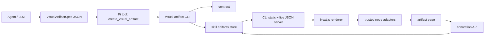

# Visualizer — Architecture

> How the JSON-to-UI runtime fits together.

## 1. System overview

Visualizer is a local presentation layer for LLMs. It lets an agent return a polished page without generating arbitrary UI code.



The project has four runtime faces:

1. **Renderer** — `app/`, a Next.js app mounted at `/artifacts`.
2. **CLI** — `cli/`, Bun binary that validates, writes, serves, lists, opens, and bootstraps artifacts.
3. **Pi extension** — `pi-extension/visual-artifact.ts`, a thin tool wrapper around the CLI.
4. **Skill docs** — `skill/SKILL.md` and `skill/references/` used by agents before creating artifacts.

The core constraint is still the product: **JSON, not generated React/HTML/CSS.**

## 2. Major components

### 2.1 Renderer (`app/`)

| Component | Responsibility | Key files |
|---|---|---|
| App Router | Routes under `basePath: "/artifacts"`. | `src/app/page.tsx`, `src/app/[project]/page.tsx`, `src/app/[project]/[slug]/page.tsx`, `src/app/live-artifact/page.tsx`, `src/app/live-project/page.tsx` |
| Client loaders | Fetch live artifact/project JSON after static shell loads. | `src/components/client-artifact-loader.tsx`, `artifact-index-loader.tsx`, `project-index-loader.tsx` |
| Renderer | Builds hero/header and recursively renders nodes. | `src/components/visual-artifact-renderer.tsx` |
| Registry | Maps `node.type` to adapter. | `src/components/component-registry.tsx` |
| Adapters | Leaf, data-backed, and layout node renderers. | `src/components/adapters/*.tsx` |
| UI primitives | shadcn/Base UI components and artifact-specific primitives. | `src/components/ui/*`, `src/components/artifact-primitives.tsx` |
| Diagrams | Mermaid renderer and sandboxed SVG iframe. | `src/components/mermaid/*`, `src/components/svg-diagram.tsx` |
| Schema/manifest | Compatibility re-export of the shared executable schema plus LLM-facing manifest consumption. | `shared/src/artifact-schema.ts`, `shared/src/contract.ts`, `src/lib/contract/artifact-schema.ts`, `src/lib/contract/artifact-manifest.ts` |
| Paths | URL/data-route helpers. | `src/lib/artifacts/paths.ts` |
| Annotations | Serialized optimistic thread state, UI, and API client. | `src/components/annotations/annotation-provider.tsx`, `src/components/annotations/annotation-panel.tsx`, `src/components/annotations/annotation-helpers.ts`, `src/lib/artifacts/annotations.ts` |

### 2.2 CLI (`cli/`)

| Command | Responsibility | Key file |
|---|---|---|
| `bootstrap` | Build renderer, compile CLI, install `~/.pi/bin/visual-artifact`. | `src/commands/bootstrap.ts` |
| `create` | Read JSON, validate, derive project, write artifact, auto-start server. | `src/commands/create.ts` |
| `validate` | Validate a spec without writing. | `src/commands/validate.ts` |
| `serve` | Serve static export + live artifact JSON + fallback shells. | `src/commands/serve.ts` |
| `migrate-store` | Safely merge legacy roots into the shared store. | `src/commands/migrate-store.ts`, `src/lib/artifact-store-migration.ts` |
| `list` | List projects/artifacts from the artifact store. | `src/commands/list.ts` |
| `open` | Open index or artifact URL. | `src/commands/open.ts` |
| `doctor` | Check binary, deps, contract, out dir, artifacts dir, server. | `src/commands/doctor.ts` |

Source development and installed binaries share `~/.agents/skills/visual-artifact/artifacts` by default. This keeps one user-visible collection regardless of which renderer mode is active.

### 2.3 Shared executable contracts (`shared/`)

The `@agents/visual-artifact-annotations` package owns both the executable artifact schema/resource preflight and annotation data/request-policy schemas. The app compatibility layer and CLI call the same artifact parser; app, CLI, and Worker share annotation validation. It defines:

- `AnnotationAuthor` — name and email, with a local anonymous fallback.
- `AnnotationAnchor` — `nodeId`, `nodePath`, `nodeType`, optional `textSnippet`, and optional `x`/`y` coordinates.
- `AnnotationThread` — id, anchor, status (`open` | `resolved`), timestamps, and messages.
- `AnnotationMutation` — `createThread`, `addMessage`, `resolveThread`, `reopenThread`, `editMessage`, and `deleteMessage`.
- `AnnotationDocument` — version, project, slug, and threads.
- `annotationMutationRequestRejection` — shared JSON/content-origin policy for local and Worker mutation routes.

The artifact resource envelope is enforced before recursive Zod parsing: 2 MiB raw/final JSON, 30 top-level/100 total nodes, 20 datasets, node depth 8, 500 file-tree items/depth 12, and 512 KiB per/1 MiB aggregate sourced content.

### 2.4 Pi extension (`pi-extension`)

The extension registers:

- `create_visual_artifact` tool
- `/visual-diff` command
- `/visual-recap` command

`create_visual_artifact` finds `visual-artifact`, sends the spec through stdin to `visual-artifact create - --project <cwd> --json`, and returns the URL from the CLI.

### 2.4 Contract and verification

| Artifact | Source/writer | Reader |
|---|---|---|
| `cli/assets/contract.json` | `app/scripts/contract/export-contract.ts` | Tracked generated contract; drift gate; compiled CLI fallback |
| `VisualArtifactSpecSchema` | `shared/src/artifact-schema.ts` (re-exported by app) | CLI, renderer, and `verify-artifacts` |
| `artifactManifest` | `shared/src/contract.ts` (consumed by `app/src/lib/contract/artifact-manifest.ts`) | Contract exporter, CLI, and docs |
| `@agents/visual-artifact-annotations` | `shared/src/artifact-schema.ts`, `shared/src/annotations.ts` | App, CLI, and Worker executable validation |

## 3. Runtime flows

### 3.1 Create from Pi

```text
Agent builds spec
  → create_visual_artifact tool
  → extension finds visual-artifact
  → CLI create reads JSON from stdin
  → CLI validates with the shared executable schema
  → CLI derives project from git root / directory
  → CLI resolves project-contained or explicitly granted file-tree sources
  → CLI writes <artifacts-dir>/<project>/<slug>/artifact.json
  → CLI starts server if needed
  → extension returns URL
```

### 3.2 Render an artifact

```text
Browser opens /artifacts/<project>/<slug>/
  → static shell loads
  → ClientArtifactLoader parses project/slug from URL
  → fetch /artifacts/data/artifacts/<project>/<slug>/artifact.json
  → Zod parse as VisualArtifactSpec
  → VisualArtifactRenderer renders nodes
  → componentRegistry dispatches to adapters
```

### 3.3 Render annotations

```text
Browser opens /artifacts/<project>/<slug>/
  → AnnotationProvider loads /artifacts/data/artifacts/<project>/<slug>/annotations.json
  → parse as AnnotationDocument
  → render comment toggle, node outlines, thread badges, and sidebar
  → user mutation enters the client transaction queue
  → optimistic state is applied only when that transaction starts
  → POST /artifacts/api/annotations/<project>/<slug> with JSON/same-origin evidence
  → local CLI serializes read→apply→atomic mode-0600 replace per bundle
  → hosted Worker retries conditional R2 writes against the latest etag
  → success replaces client state with the parsed authoritative document
  → failure rolls back before the next queued transaction starts
```

### 3.4 Static export + live JSON

```text
cd app && pnpm build
  → exports shell-only static app to app/out by default
  → never embeds local user artifacts unless VISUAL_ARTIFACT_ARTIFACTS_DIR is explicit

visual-artifact serve
  → serves static files from ~/.local/share/visual-artifact/app/out
  → serves JSON/assets from <artifacts-dir>
  → builds live index JSON at /artifacts/data/artifacts/index.json
  → falls back to live-artifact/live-project shells for post-build artifacts
```

This is why new artifacts can be created after build without rebuilding the renderer.

## 4. Filesystem and URL contracts

Artifacts are stored as bundles:

```text
<artifacts-dir>/
  <project>/
    <slug>/
      artifact.json
      annotations.json
      assets/
```

| Path | Role |
|---|---|
| `<artifacts-dir>/<project>/<slug>/artifact.json` | Artifact spec inside a bundle. |
| `<artifacts-dir>/<project>/<slug>/annotations.json` | Persisted annotation threads for the artifact. |
| `<artifacts-dir>/<project>/<slug>/assets/` | Sidecar images and other assets. |
| `~/.local/share/visual-artifact/app/out` | Installed static renderer export. |
| `/artifacts/<project>/<slug>/` | Artifact page route. |
| `/artifacts/data/artifacts/<project>/<slug>/artifact.json` | Public artifact JSON endpoint. |
| `/artifacts/data/artifacts/<project>/<slug>/annotations.json` | Public annotation JSON endpoint. |
| `/artifacts/api/annotations/<project>/<slug>` | Annotation mutation endpoint. |
| `/artifacts/data/artifacts/index.json` | Live home index. |
| `/artifacts/data/artifacts/<project>/index.json` | Live project index. |

Environment overrides:

| Variable | Effect |
|---|---|
| `VISUAL_ARTIFACT_SKILL_ROOT` | Stable skill namespace, default `~/.agents/skills/visual-artifact`. |
| `VISUAL_ARTIFACT_ARTIFACTS_DIR` | Explicit artifact storage directory override. |
| `VISUAL_ARTIFACT_OUT_DIR` | Static export directory. |
| `VISUAL_ARTIFACT_CONTRACT_PATH` | Contract file. |
| `VISUAL_ARTIFACT_PORT` / `VISUAL_ARTIFACT_HOST` | Server bind address. Non-loopback hosts require explicit remote exposure. |
| `VISUAL_ARTIFACT_ALLOW_REMOTE` | Strict `0|1` opt-in for a non-loopback writable server bind. |
| `VISUAL_ARTIFACT_MOUNT_PATH` | Public mount path, default `/artifacts`. |
| `VISUAL_ARTIFACT_DATA_PATH` | Data path under mount, default `/data/artifacts`. |
| `VISUAL_ARTIFACT_BASE_URL` | URL base returned by `create` and `open`. |

## 5. Tradeoffs

### JSON-not-code

Agents lose arbitrary expressiveness, but gain stable rendering, smaller prompts, and safer output.

### Shared executable contract

The CLI and renderer use the same Zod artifact schema from `shared/`; the app re-export preserves import compatibility. The tracked exported JSON remains the agent/tooling handshake and compiled CLI reference, while `verify.sh` rejects generated drift.

### Static app, live data, and annotations

Static export keeps serving simple. Live JSON endpoints keep artifacts dynamic. Local annotation edits require the CLI server; published Cloudflare pages use the Worker mutation route and R2. Both mutation routes require an existing artifact and apply the shared JSON/origin policy. The fallback shell is the bridge for runtime artifacts. Keeping production exports shell-only prevents private local specs from leaking into release archives.

### Skill-namespace bundle storage

Artifacts are stored as bundles (`artifact.json`, `annotations.json`, `assets/`) under `~/.agents/skills/visual-artifact/artifacts` by default. The directory is user-owned output: renderer and skill updates must preserve it. One shared store lets development and installed renderers expose the same collection; use `VISUAL_ARTIFACT_ARTIFACTS_DIR` only for an intentional alternate store. Installers stop the default renderer before copying legacy roots, verify the snapshot, and retain each legacy root as a safety backup.

### Annotation persistence

Local mutation transactions are queued by artifact, validated, and atomically replace `annotations.json`; hosted writes use bounded R2 compare-and-swap retries. The renderer serializes whole optimistic transactions: success adopts the server-returned document, and failure rolls back before later work begins. Same-origin checks reduce browser cross-site writes but are not user authentication.

## 6. Change hotspots

- New node type: schema, manifest, adapter, registry, contract.
- URL/path change: `app/src/lib/artifacts/paths.ts`, CLI serve/create/open, README/docs.
- Storage change: CLI config, serve/list/open/create, docs, extension expectations.
- Contract change: export contract, verify artifacts, rebuild CLI if bundled fallback matters.
- Annotation change: update shared schema/policy, then renderer, CLI, and Worker tests; keep local and hosted boundary fixtures in sync.
